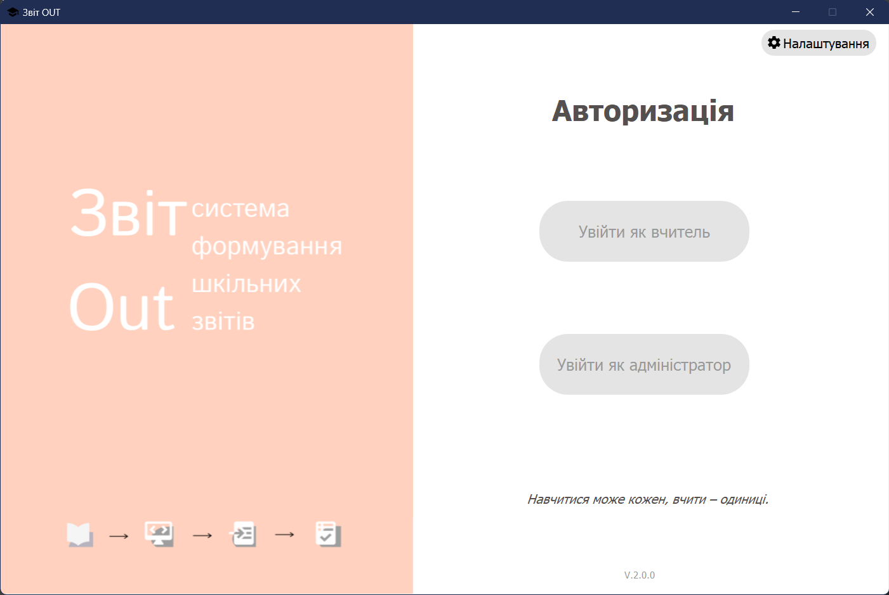

## ZvitOUT (ЗвітOUT)
## Table of contents

- [Overview](#overview)
- [Built with](#built-with)
- [Screenshots](#screenshot)

## Overview
ZvitOUT (ukr. - ЗвітOUT) - is a python desktop application, created for teachers' communities to help create students achievements reports automatically.

### Built-with

- Python 3.10 
- PyQt5 (UI)
- FPDF/FPDF2 (pdf-docs)
- Pandas (processing data from database)
- PyMySQL, sqlalchemy (queries)
- JSON (store and read connection parameters)
- Environments: PyCharm, Qt Designer 

### Screenshots
#### Main window

Main window has 3 buttons - Log in as a teacher, log in as an admin (soon), settings.
#### Teacher log in window

It has a password field, buttons 'Log in', 'Back main', 'Settings'
#### Settings

A window to set up a database connection settings.
#### Reports page

Contains a table with all the created reports of current period.
#### New Report

#### Filtered reports

#### Print

#### Example of created report

